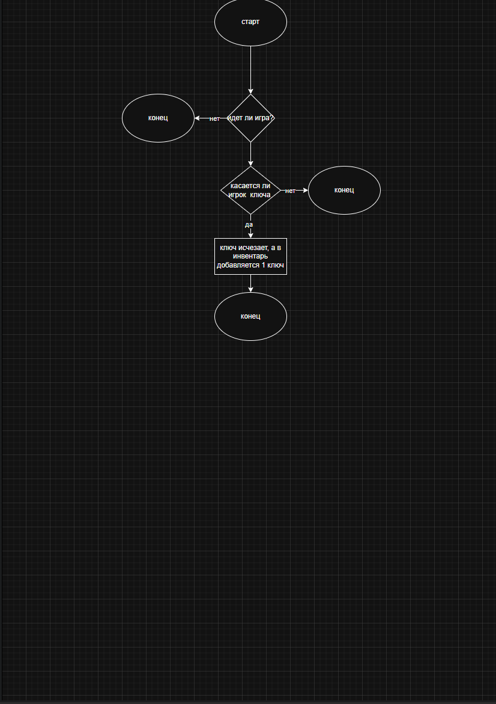
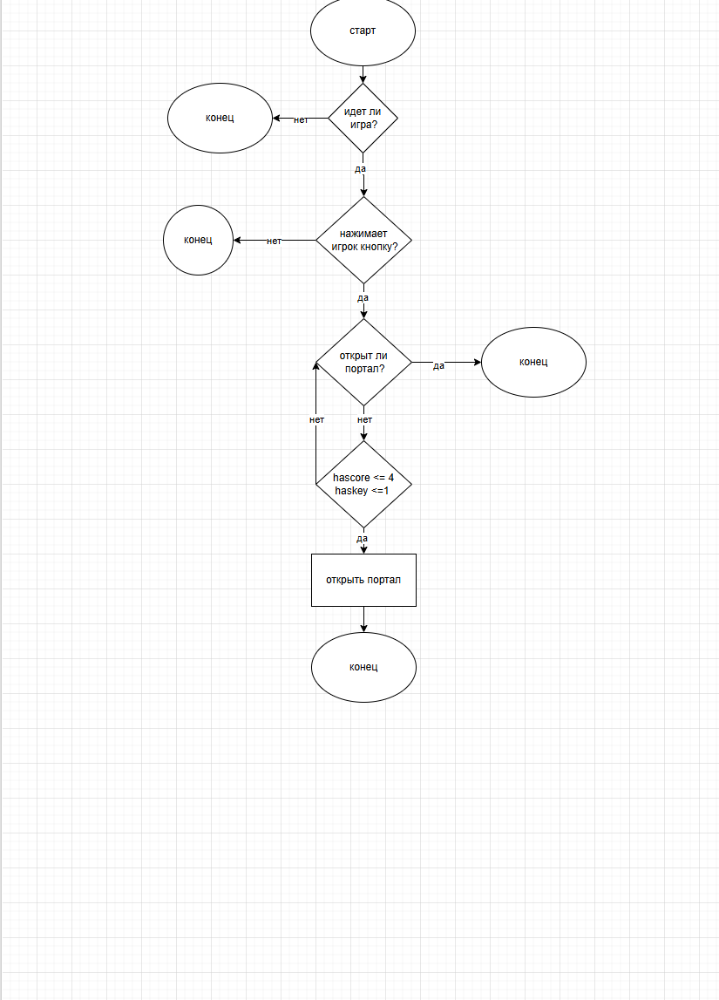
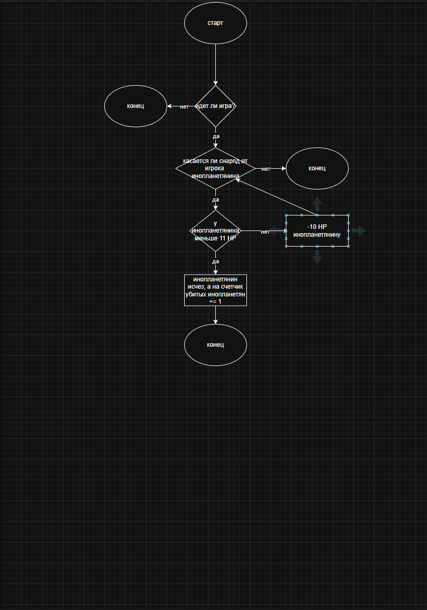

# Расширенный паспорт мобильной игры

---

**Автор:** Кравченко Владислав  
**Игра:** Звездный бой  
**Дата экспорта:** 01.07.2026

---

## 0. Фамилия, имя и название проекта

Сначала зафиксируй автора и рабочее название игры.

**Фамилия и имя:** Кравченко Владислав

**Группа / класс:** —

**Название игры:** Звездный бой

---

## 1. Проектное ядро игры

Не сюжет целиком, а точная формула: что это за игра и почему в неё будут играть.

> Жанровая формула = основной жанр + дополнительный элемент + действие или ощущение игрока. Пример структуры: «казуальное приключение с элементами сбора ресурсов и восстановления мира».

**Жанровая формула:** RPG стратегия у которой цель отбиться от волн инопланетян

**Сеттинг:** в мире бедующего

**Главное действие игрока:** сражается  с инопланетянами

**Цель игрока:** игрок должен защитить землю

**Главная фишка / УТП:** волны противников, управление кораблёв

**Оффер:** Прекрасные сражения с волнами инопланетян с постепенным усложнением новых волн, интересные механики

---

## 2. Целевая аудитория и аватар игрока

Проектирование начинается не с кнопок, а с понимания игрока.

> ЦА не может быть «для всех». Нужно описать конкретную группу: возраст, игровые привычки, настроение, любимые действия и раздражители.

**Целевая аудитория одной фразой:** моя игра для тех кто любит RPG

**Возраст и игровой опыт:** 10-13 лет, новичок

**Где и когда играет:** перемена в школе и дома 5-10 минут

**Что хочет почувствовать:** Победу и исследование лора мира

**Что раздражает:** сложность с первых секунд сражения

**Почему вернётся:** ежедневная награда,

**Имя, возраст, любимые игры:** Иван 12 лет, Mindustry

**Что может остановить:** проигрыш

**Почему скачает игру:** его зацепит интересный лор

**Что заставит вернуться:** он будет пытаться заспидранить игру быстрее и быстрее

---

## 3. Конкуренты и референсы

Найди похожие проекты, чтобы понять рынок, а не чтобы копировать.

> Референс — это пример для анализа: жанр, интерфейс, атмосфера, цвета, персонажи, карта, кнопки, прогресс. Референс не копируют полностью.

| Конкурент / тип | Ссылка | Что похоже | Что хорошо сделано | Что сделать иначе | Что взять как референс |

| --- | --- | --- | --- | --- | --- |

| Super Hydorah | https://store.steampowered.com/app/628800/Super_Hydorah/ | смысл игры | враги | сделать более широкие поля игры | интерфейс |

| Galaxy Invaders | https://play.google.com/store/apps/details?id=com.studio47games.alien.space.starship.shooter.sky.galaxy.jet | смысл игры | звездный корабль | сделать звёздный корабль | снаряды |

|  |  |  |  |  |  |

---

## 4. Объекты игры

Сначала перечисли, что существует в игре. Потом под каждый объект подберёшь ассет.

> Обязательные объекты: герой или главный объект, предмет/ресурс для сбора, препятствие, цель или награда, UI-элемент, фон или сцена. Остальные можно добавлять без ограничения.

| Объект | Роль в игре | Что с ним делает игрок | Состояния объекта | Обязательный? |

| --- | --- | --- | --- | --- |

| главный герой | звёздный корабль | летает на нём и стреляет в инопланетян | стоит, двигается, стреляет, лечиться, получает урон | да |

| ключ | открывает портал | открывает им портал | (не) в инвентаре, | да |

| инопланетные корабли | атакуют гг | атакует его | стоит, двигается, стреляет, получает урон | да |

| главный инопланетянин | босс последний | атакует его | стоит, двигается, стреляет, лечиться, получает урон | да |

| кнопки вверх-вниз | управление | нажимает | вкл/выкл | да |

| ядро | открывает портал | открывает им портал | 1,2,3,4,5,6,7 | да |

---

## 5. Ассеты и мудборд

Для каждого объекта нужен материал: свой или найденный с понятной лицензией.

> Ассет — готовый элемент игры: персонаж, фон, предмет, кнопка, иконка, звук, музыка, анимация, UI-панель.

> Мудборд — подборка визуальных примеров для настроения проекта: цвета, атмосфера, интерфейс, персонажи, фон, иконки. Мудборд нужен, чтобы объяснить стиль, а не чтобы копировать чужие картинки.

### План ассетов под объекты

| Объект | Какой ассет нужен | Где взять / создать | Ссылка | Лицензия | Автор / credits |

| --- | --- | --- | --- | --- | --- |

| герой | 2D-спрайты | opengameart | https://opengameart.org/content/space-shooter-sprites | CC-BY 3.0 | Blarget2 |

| ядро | 2D art | opengameart | https://opengameart.org/content/12-pixel-asteroids-and-space-junks | CC0 | Rocks7 |

| инопланетяне | 2D-спрайты | opengameart | https://opengameart.org/content/space-shooter-sprites | CC-BY | Blarget2 |

| кнопки вверх-вниз | 2D art | kenney | https://kenney.nl/assets/mobile-controls | CC0 |  |

| фон | 2D art | opengameart | https://opengameart.org/content/space-background | CCO | Cuzco |

**Каким должен быть визуальный стиль:** синий, вид бедующего

**Ссылки на 3–5 визуальных референсов:** https://opengameart.org/content/space-shooter-sprites - Враги, снаряды, главного героhttps://opengameart.org/content/space-background - фон

---

## 6. Усложнённый MVP

MVP — маленький рабочий кусок, а не вся игра мечты.

**Цель MVP:** открыть портал

**Минимальная сцена:** один уровень

**Главные объекты MVP:** герой, корабль инопланетян, портал

**Главное препятствие:** инопланетяне

**NPC или подсказка:** Командир

**Что считаем:** HP, монеты, убитых врагов

**Условие победы:** если у игрока есть 3 ядра и 1 ключ, то портал открывается и идет анимация прохода в портал и выдаётся сообщение "Вы выиграли"

**Условие ошибки / проигрыша:** если игрок пропускает ключ и у игрока его нету то выдаётся сообщение "Вы упустили ключ"

**Что не входит в первую версию:** магазин, 2 уровень

**Какой баг нужно проверить:** один убитый инопланетянин не должен засчитываться за 2 и более

**Почему MVP реалистичен:** потому что это будет сделать легче

---

## 7. Механики игры

Опиши минимум 3 механики. Больше можно, если они реально нужны MVP.

> Механика — это повторяемое действие игрока и результат в игре. Формула: действие игрока → проверка условия → результат → новое состояние.

| Механика | Что делает игрок | Условие | Результат | Что считаем / проверяем |

| --- | --- | --- | --- | --- |

| подбирание ключа | игрок касается ключа | если игрок нажимает подобрать | ключ исчезает, а в инвентарь добавляется 1 ключ | исчез ли ключ и добавился ли он в инвентарь |

| убийство инопланетянина | сиреляет | если снаряды касаются инопланетянина | инопланетянин умирает, а счетчик = счетчик+1 | исчез ли инопланетянин и добавилась ли единица к счетчику убитых инопланетян |

| открытие портала | нажимает кнопку на портале | если игрок нажал на кнопку и у него есть 3 энергетических ядра и 1 ключ | портал открылся | открылся ли портал и исчезли ли 3 ядра и 1 ключ |

---

## 8. Схемы механик

Схема помогает увидеть логику до макета. Делай в draw.io / diagrams.net или на бумаге.

> Формула схемы:
> Действие игрока → Проверка условия → Результат → Следующее состояние

> Минимум 2–3 схемы. Не ограничивайся количеством, если в MVP больше важных механик.

| Что схематизируешь | Тип схемы | Ссылка / где лежит | Что должно быть видно |

| --- | --- | --- | --- |

| подбирание ключа | действие условие результат |  | ключ исчезает а счетчик ключей = счетчик ключей +1 | 

| открытие портала | действие условие результат |  | исчезает 3 ядра и 1 ключ |

| убийство инопланетянина | действие условие результат |  | инопланетянин исчез, а счетчик убитых инопланетян = счетчик убитых инопланетян + 1 |

---

## 9. Сцены для будущего макета

Сцена — это экран или состояние игры, которое можно будет нарисовать.

> Примеры сцен: стартовый экран, обучение, основной игровой экран, опасная зона, карта уровня, инвентарь, диалог с NPC, экран победы, экран ошибки, экран выбора уровня.

> Пример перехода: Стартовый экран → нажал Play → Основная сцена. Основная сцена → собрал 3 ключа → Открытые врата. Опасная зона → вошёл без нужного предмета → Предупреждение или потеря HP.

| Сцена | Что видит игрок | Что может сделать | Переход дальше |

| --- | --- | --- | --- |

| Стартовый экран | название игры, под ней Play | нажать Play | переход в игру |

| Игровой экран | на фоне космос, слева сверху шкала здоровья, справа посередине звёздный корабль, кнопка атаковать справа снизу, кнопки вверх вниз слева вверху и внизу | нажать кнопку "Атака" | переход к новой волне |

| Победный экран | посередине сообщение вы выиграли на фоне космоса, и кнопка вернуться на стартовый экран | вернуться на стартовый экран | на стартовый экран |

| Сцена поражения | посередине надпись "Вы умерли" под ней надпись вернуться на стартовый экран | вернуться на стартовый экран | на стартовый экран |

---

## 10. Гипотеза и метрики проверки

Теперь сформулируй, что именно ты хочешь проверить на игроке.

> Гипотеза — предположение, которое можно проверить. Шаблон: «Я думаю, что [кому] будет интересно [что сделать], потому что [какая потребность закрывается]».

- [x] ИГРОК ПОНЯЛ ЦЕЛЬ ЗА ПЕРВЫЕ 30 СЕКУНД.

- [x] ИГРОК СДЕЛАЛ ПЕРВОЕ ДЕЙСТВИЕ БЕЗ ПОДСКАЗКИ.

- [x] ИГРОК ПРОШЁЛ MVP ЗА 3–5 МИНУТ.

- [ ] ИГРОК СМОГ ОБЪЯСНИТЬ ГЛАВНОЕ ПРАВИЛО.

- [ ] ИГРОК ЗАХОТЕЛ УВИДЕТЬ СЛЕДУЮЩИЙ УЧАСТОК / УРОВЕНЬ.

- [x] Я ЗАПИСАЛ, ГДЕ ИГРОКУ БЫЛО НЕПОНЯТНО.

**Гипотеза:** я думаю, что игрокам будет интересно добавление новых врагов, потому что это улучшает геймплей

**Кто будет тестировать:** 11 лет, без опыта, 1 человек из ЦА

**Что игрок должен понять за 30 секунд:** цель игры

**Что игрок должен сделать за 3–5 минут:** пройти игру

---

## 11. Финальный чек-лист качества

Проверь работу перед сдачей.

- [x] УКАЗАНЫ ФАМИЛИЯ, ИМЯ И НАЗВАНИЕ ИГРЫ.

- [x] ЖАНРОВАЯ ФОРМУЛА КОНКРЕТНАЯ, А НЕ ТОЛЬКО СЮЖЕТ.

- [x] ЦА НЕ «ДЛЯ ВСЕХ».

- [x] ЕСТЬ АВАТАР ИГРОКА.

- [x] ЕСТЬ 2–3 КОНКУРЕНТА ИЛИ КОНКУРЕНТНЫХ ТИПА СО ССЫЛКАМИ.

- [x] ЕСТЬ УТП И ОФФЕР.

- [x] ПЕРЕЧИСЛЕНЫ ОБЪЕКТЫ ИГРЫ, ВКЛЮЧАЯ ОБЯЗАТЕЛЬНЫЕ.

- [x] ПОД КАЖДЫЙ ОБЪЕКТ ЗАПЛАНИРОВАН АССЕТ.

- [x] У АССЕТОВ УКАЗАНЫ ИСТОЧНИКИ И ЛИЦЕНЗИИ.

- [x] ЕСТЬ МУДБОРД ИЛИ ССЫЛКИ НА ВИЗУАЛЬНЫЕ РЕФЕРЕНСЫ.

- [x] MVP ОГРАНИЧЕН И РЕАЛИСТИЧЕН.

- [x] ОПИСАНО МИНИМУМ 3 МЕХАНИКИ.

- [x] ЕСТЬ МИНИМУМ 2–3 СХЕМЫ МЕХАНИК.

- [x] ЕСТЬ СПИСОК СЦЕН И ПЕРЕХОДОВ МЕЖДУ НИМИ.

- [x] ЕСТЬ ГИПОТЕЗА И МЕТРИКИ ПРОВЕРКИ.

- [x] КАРТОЧКА ПОДГОТОВЛЕНА К PDF ИЛИ СКРИНШОТУ.

---

## 12. Формат сдачи

Собери материалы так, чтобы их можно было быстро проверить.

> Как сохранить: для PDF нажми «Подготовить к PDF/скрину», затем «Сохранить в PDF». Для текстовой версии нажми «Скачать MD» или «Копировать MD».